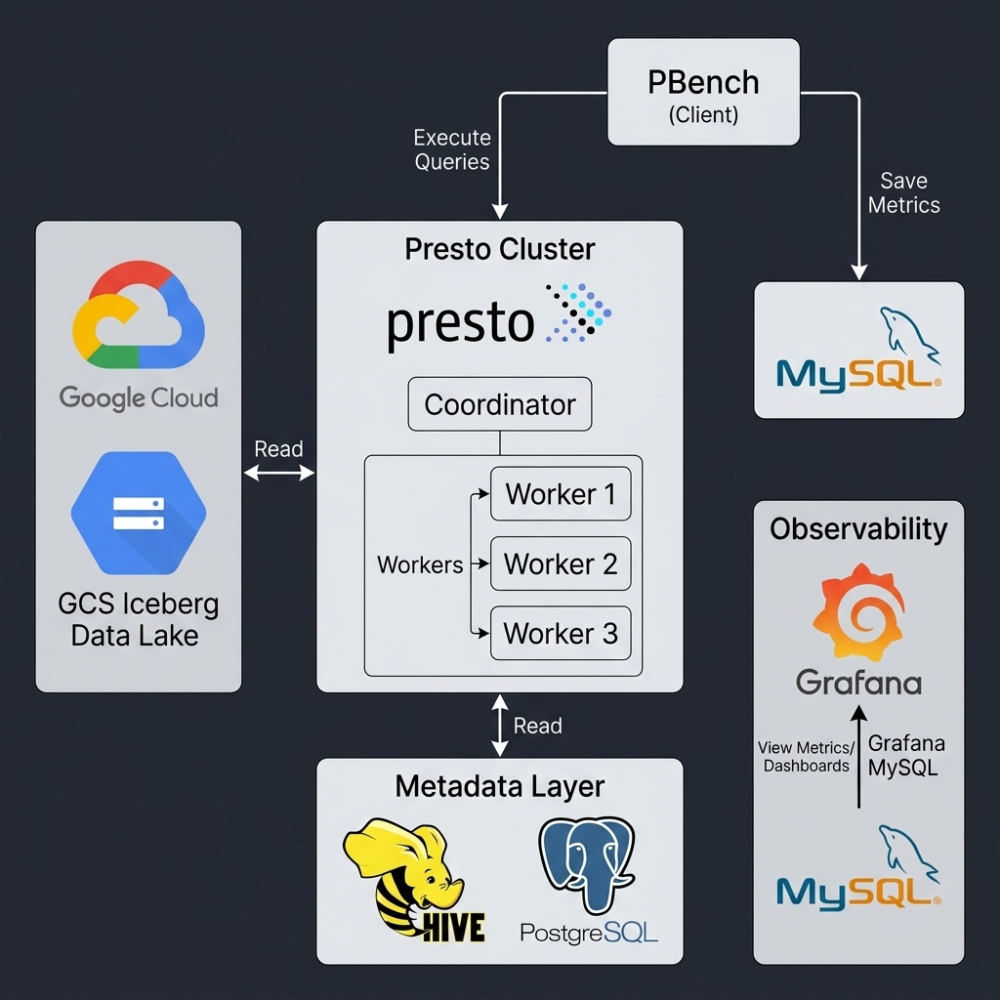

# Benchmarking Presto on TPC-H and TPC-DS Data (Iceberg & Google Cloud Storage)



This repository provides a standardized deployment for Presto (Java) optimized for executing TPC-H and TPC-DS benchmarks on Iceberg data lakes stored in Google Cloud Storage (GCS).

## Data Preparation Workflow

The datasets in this environment were prepared using a three-layer "Raw-to-Gold" architecture:

1.  **Raw Generation**: TPC-H and TPC-DS datasets were generated at Scale Factor 10 using standard generators (`tpch-gen` and `tpcds-gen`).
2.  **Schema Mapping (Raw Layer)**: External Hive tables with a trailing dummy column were created to map the raw `.dat` files on GCS. This layer handles CSV parsing.
3.  **Optimization (Gold Layer)**: Data was migrated into managed Iceberg tables using `INSERT` statements with explicit type casting and hidden partitioning (e.g., `lineitem` partitioned by month). This ensures the Parquet files are optimized for analytical performance.
4.  **Statistics Collection**: Immediately following migration, `ANALYZE` was performed on all tables to enable Cost-Based Optimization (CBO) in Presto.

## System Architecture

The environment is orchestrated via Docker Compose and consists of the following components:

*   **Presto Coordinator**: Manages query orchestration and metadata.
*   **Presto Worker**: Java-based execution node with 12GB heap and spilling-to-disk enabled.
*   **Hive Metastore**: Thrift-based metadata management service.
*   **PostgreSQL 15**: Dedicated backend database for the Hive Metastore.
*   **MySQL 8.0**: Persistent backend for storing pbench benchmark result summaries.
*   **Grafana**: Visualization dashboard for performance analysis.

## Service Endpoints

| Service | Host Port | Internal Port | Description |
| :--- | :--- | :--- | :--- |
| Presto UI | 8080 | 8080 | Coordinator status and query monitoring |
| Grafana | 3000 | 3000 | Benchmarking dashboards (admin/admin) |
| MySQL | 3307 | 3306 | Metrics database (pbench/pbench_password) |
| Metastore | 9083 | 9083 | Thrift Metastore endpoint |

## Prerequisites

*   **Docker & Docker Compose**: Minimum 16GB RAM allocation recommended.
*   **GCS Access**: A Google Cloud service account key with storage access. Place the file as `gcs-key.json` in the root directory.
*   **PBench Binary**: The included `pbench` binary is compiled for **macOS (Darwin ARM64)**. Linux users must replace this with a Linux-compatible pbench binary.
*   **Iceberg Data**: TPC-H and TPC-DS datasets previously generated and stored in an Iceberg/GCS bucket.

## Deployment Instructions

### 1. Initialize the Cluster
```bash
docker-compose up -d
```
Ensure all services reach a `healthy` state before proceeding.

### 2. Schema and Table Initialization
Before benchmarking, you must migrate your raw TPC-DS data into the optimized Iceberg Gold layer. 

```sql
-- Connect via presto-cli directly to the iceberg catalog
docker exec -it presto-coordinator presto --catalog iceberg

-- Create the target schema with explicitly defined GCS location
CREATE SCHEMA IF NOT EXISTS tpcds_sf10
WITH (location = 'gs://your-bucket-name/path/to/tpcds_sf10/');

-- Note: After creating the schema, execute the CTAS (Create Table As Select) 
-- statements to migrate your raw data into this Iceberg schema.
```

### 3. Execute Benchmarks
Navigate to the `pbench` directory and execute the suite. 
*(Pro-Tip: Always discard the results of the first run. The JVM needs time to warm up and JIT-compile the execution paths.)*

```bash
cd pbench

# Run the TPC-DS benchmark suite
./pbench run --mysql mysql.json tpcds_sf10_iceberg.json
```

## Configuration Specifications

### Memory Management
The worker node is configured for high-concurrency analytical queries:
*   **JVM Heap**: 12GB (`-Xmx12G`)
*   **Query Max Memory**: 6GB (User memory per node)
*   **Disk Spilling**: Enabled via `/tmp/presto-spill` (mounted to the host) to handle joins that exceed physical memory.

### GCS Connectivity
The GCS connector is configured in `hive-metastore/core-site.xml`. This single file drives GCS connectivity for the entire cluster (Coordinator, Worker, and Metastore).

## Visualization
Benchmark results are streamed in real-time to MySQL. You can connect the local Grafana instance to visualize the execution metrics:

1. Navigate to `http://localhost:3000` (admin/admin).
2. Connect a new MySQL Datasource (`mysql:3306`, Database: `pbench`).
3. Build dashboards querying the `run` and `query` tables.


## Community (Stay Connected with Presto Ecosystem)
*  Official Website: [prestodb.io](https://prestodb.io/)
*  Official Docs: [prestodb.github.io/docs](https://prestodb.github.io/docs/0.297/index.html)
*  Join Slack Community: [Join Here](https://communityinviter.com/apps/prestodb/prestodb)
